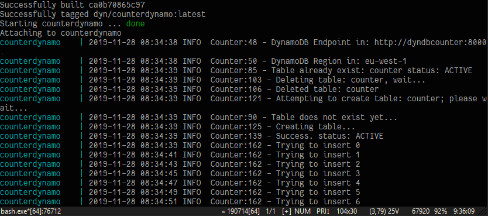
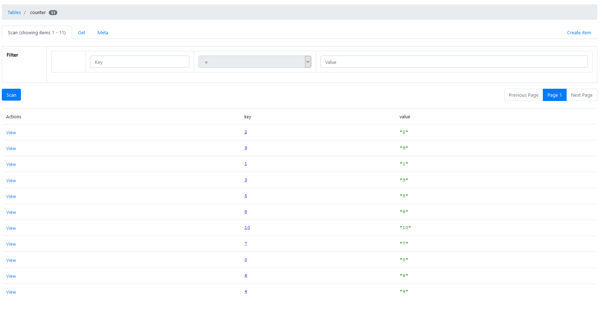

# counterdynamo

Small programm to test the functionality of [Amazon DynamoDB](https://aws.amazon.com/dynamodb/) deployed locally in [docker container](https://hub.docker.com/r/amazon/dynamodb-local).

Web-UI used to manage / view the DynamoDB **local** instance is [dynamodb-admin](https://hub.docker.com/r/aaronshaf/dynamodb-admin).

## What?

A small java programm that tries to write a key-value pair of integer and string every 2s in the local DynamoDB instance indefinitely.
Every time the program is started, existing table in the database will be deleted and recreated.

The DynamoDB instance is accessible in `http://localhost:8000/`, while the web-UI to view the contents of the database is accessible in `http://localhost:8001/`.

Configuration files location:

* Amazon credentials and DynamoDB url configuration for the java program is located in `src/main/resources/dynamodb.properties`
* DynamoDB container: `compose/dynamodb/`
* Web-UI container: `compose/dynadmin/`

## How?

### Requirement

* [Docker](https://www.docker.com/) is installed.

### Steps

* Create bridging network: `docker network create dyn`
* Start the DynamoDB container
	* go to `compose/dynamodb/`
	* `docker-compose up`
	* default DynamoDB shell in `http://localhost:8000/shell/`

* Start the web-UI (optional)
	* go to `compose/dynadmin/`
	* `docker-compose up`
	* go to `http://localhost:8001`

* Compile the programm in IntelliJ and then run

## Screenshots

Example output:

Web-UI:
